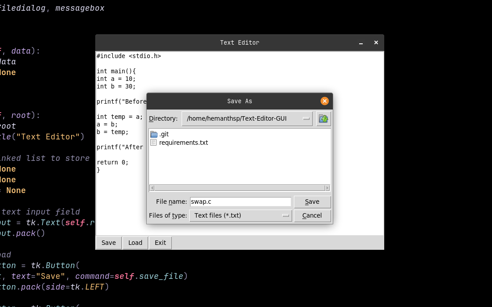

# Basic GUI-Text-Editor using Tkinter library in Python

### How to Use ?

```bash
git clone https://github.com/Hemanthsp999/Text-Editor-GUI.git

cd Text-Editor-GUI
```

### Install Tkinter

For Windows, Open command prompt and run :

```bash
pip install tk
```

For MacOS, Open a terminal and run :

```bash
brew install tcl-tk
```

For Linux, Open a terminal and run :

```bash
sudo apt-get update
sudo apt-get install python3-tk
```

Verify Installation by running this script and save it as <b>"test_tkinter.py"</b> :

```bash
import tkinter as tk

root = tk.Tk()
root.title("Test Tkinter")
root.geometry("300x200")

label = tk.Label(root, text="Hello, Tkinter!")
label.pack(pady=20)

root.mainloop()
```

run the script :

```bash
python3 test_tkinter.py
```

### After Installation, run the project:

```bash
python3 text.py
```

Text Editor


writing swap program in c


save the program



program output


